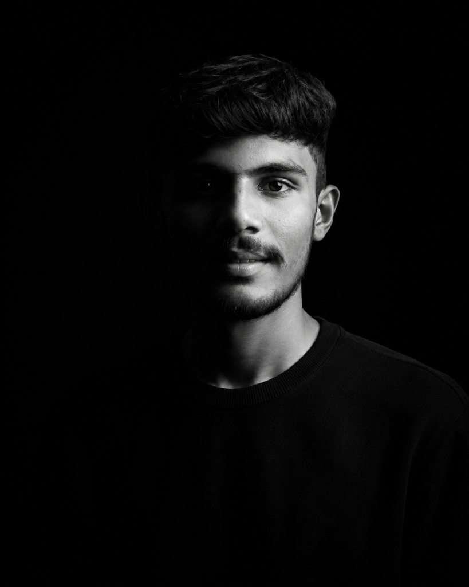

# Personal Portfolio — Aditya Mohite

A modern, dark-themed personal developer & UI/UX designer portfolio built using **pure HTML and CSS**. Designed and developed for **Builders Day (Class 11 - WebDev 101)**.



---

## 🌟 About

I am a Computer Science student and aspiring UI/UX Designer & Frontend Developer. This portfolio showcases my design philosophy, skills, academic journey, and real hands-on projects built with clean, responsive, and accessible code.

- **Design Style**: Sleek Dark Theme with neon orange accents (`#ff5e14`), glassmorphism cards, and subtle geometric ambient facets.
- **Tech Stack**: 100% Pure HTML5 & Modern CSS3 (Zero JavaScript dependencies).
- **Core Focus**: Clean + Responsive + Functional + Personal.

---

## 🛠️ Technologies & Concepts Used

### 1. Semantic HTML5
- Semantic landmark elements: `<header>`, `<nav>`, `<main>`, `<section>`, `<article>`, `<footer>`
- Accessible forms with `<label>`, `<input>`, `<select>`, `<textarea>`, and validation states
- Structured data representation using semantic `<table>` elements and descriptive headings (`<h1>` through `<h4>`)

### 2. CSS Architecture & Box Model
- CSS custom properties (`:root` design tokens for colors, radii, shadows, and transitions)
- Explicit margin, padding, border-radius, and borders
- `box-sizing: border-box` normalization throughout

### 3. Layout Systems
- **Flexbox**:
  - Sticky Navigation bar with space-between distribution
  - Hero split layout, CTA buttons, and social icon rings
  - Experience stats card with vertical dividers
  - Form field stacking and footer alignments
- **CSS Grid**:
  - Services card grid (`repeat(4, 1fr)`) with responsive wrapping
  - About bento grid (`grid-template-columns: 1fr 1fr`)
  - Skills categories grid
  - Portfolio project cards gallery (`repeat(auto-fit, minmax(320px, 1fr))`)

### 4. Positioning & Depth
- `position: sticky` navigation bar with `backdrop-filter: blur(16px)`
- `position: relative` and `absolute` coordinate positioning for the hero circular backdrop, floating status badges, and timeline markers
- `z-index` layering for ambient geometric facets, content frames, and modals

### 5. Transitions & Keyframe Animations
- Smooth hover elevation (`translateY(-8px)`) and glow effects on cards and buttons
- CSS `@keyframes pulseGlow` for ambient hero lighting
- CSS `@keyframes floatAnim` for floating interactive badges
- Smooth image zoom on project card hover (`transform: scale(1.05)`)

### 6. Responsive Design
- Tested and optimized across:
  - 📱 **Mobile** (<= 480px)
  - 📱 **Tablet** (<= 768px with pure CSS slide-out hamburger navigation)
  - 💻 **Laptop** (<= 1024px)
  - 🖥️ **Desktop** (1280px+)

---

## 📂 Featured Projects

### 1. Flexbox Quest — CSS Interactive Game
- **Screenshot**: `images/flexbox-quest.png`
- **Live Demo**: [Open Flexbox Quest](projects/Assignment2.html)
- **Technologies**: HTML5, CSS Flexbox, Game UI, Responsive Design
- **Description**: An interactive gamified interface designed to teach and master CSS Flexbox mechanics, featuring lives, coins, alignment axes (`justify-content`, `align-items`), `flex-wrap`, and container direction controls.

### 2. ShopEasy — Modern E-Commerce Storefront
- **Screenshot**: `images/shopeasy.png`
- **Live Demo**: [Open ShopEasy](projects/shoppingweb.html)
- **Technologies**: HTML5, CSS Grid, Flexbox, E-Commerce UI
- **Description**: A full-featured shopping storefront prototype featuring a top search bar, multi-category navigation bar, deal-of-the-day product showcases, discount cards, and a shopping cart interface.

### 3. Student Portal & Course Registration System
- **Screenshot**: `images/student-portal.png`
- **Live Demo**: [Open Student Portal](projects/assignment1.html)
- **Technologies**: Semantic HTML, CSS, Forms, Tables
- **Description**: An academic portal featuring structured student information tables, weekly schedules, radio/checkbox course selectors, and an accessible registration form.

---

## 📁 Project Directory Structure

```text
student portfolio/
│
├── index.html              # Main portfolio semantic HTML
├── style.css               # Complete stylesheet with design system & media queries
├── README.md               # Project documentation & TA guide
│
├── images/                 # Project assets & screenshots
│   ├── profile.png         # Real user portrait photo
│   ├── flexbox-quest.png   # Screenshot of Flexbox Quest
│   ├── shopeasy.png        # Screenshot of ShopEasy
│   └── student-portal.png  # Screenshot of Student Portal
│
└── projects/               # Real project source files
    ├── Assignment2.html    # Flexbox Quest source
    ├── shoppingweb.html    # ShopEasy storefront source
    ├── assignment1.html    # Student Portal source
    └── style.css           # ShopEasy styles
```

---

## 🧑‍🏫 TA Evaluation Guide

| Question | Explanation |
| :--- | :--- |
| **Why did you use Flexbox in the Hero section?** | Flexbox provides straightforward 1D alignment for the content column, button clusters, and social icons, allowing elements to center, space out, and re-order smoothly. |
| **Why did you use CSS Grid for Projects & Services?** | Grid enforces consistent multi-column and 2D alignment across cards with identical heights, equal gaps, and automatic wrapping (`repeat(auto-fit, minmax(320px, 1fr))`). |
| **How does the mobile navigation work without JavaScript?** | It uses the pure CSS checkbox hack: `<input type="checkbox" id="nav-toggle">` paired with `<label>` and the CSS general sibling combinator `.nav-toggle:checked ~ .nav-menu { right: 0; }`. |
| **What do the media queries handle?** | At `1024px`, 4-column grids collapse to 2 columns and font sizes scale. At `768px`, the hero stacks with the photo on top, the hamburger menu is activated, and cards adapt to full width. |

---

## 👤 Author

- **Name**: Aditya Mohite
- **Track**: Scaler WebDev 101 — Group D (Class 11 Builders Day)
- **Role**: UI/UX Designer & Frontend Developer
- **Email**: `aditya.mohite@example.com`
